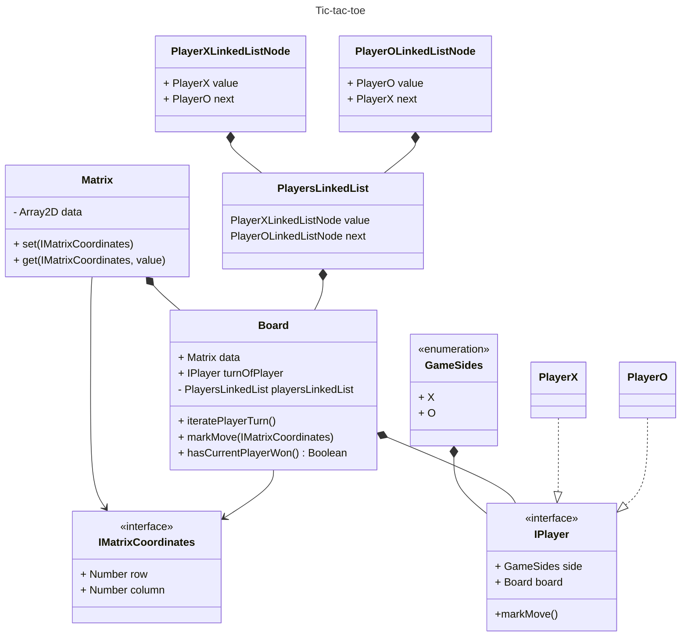

# Tic-tac-toe UML

```mermaid
---
title: Tic-tac-toe
---

	classDiagram
    class IMatrixCoordinates {
        <<interface>>

        + Number row
        + Number column
    }

    Matrix --> IMatrixCoordinates
    class Matrix {
        - Array2D data

        + set(IMatrixCoordinates)
        + get(IMatrixCoordinates, value)
    }

    class PlayerXLinkedListNode {
        + PlayerX value
        + PlayerO next
    }

    class PlayerOLinkedListNode {
        + PlayerO value
        + PlayerX next
    }

    PlayerXLinkedListNode *-- PlayersLinkedList
    PlayerOLinkedListNode *-- PlayersLinkedList
    class PlayersLinkedList {
        PlayerXLinkedListNode value
        PlayerOLinkedListNode next
    }

    Matrix *-- Board
    Board --> IMatrixCoordinates
    PlayersLinkedList *-- Board
    class Board {
        + Matrix data
        + IPlayer turnOfPlayer
        - PlayersLinkedList playersLinkedList

        + iteratePlayerTurn()
        + markMove(IMatrixCoordinates)
        + hasCurrentPlayerWon() Boolean
    }

    class GameSides {
        <<enumeration>>
        + X
        + O
    }

    GameSides *-- IPlayer
    Board *-- IPlayer

    class IPlayer {
        <<interface>>
        + GameSides side
        + Board board

        +markMove()
    }

    PlayerX ..|> IPlayer
    class PlayerX {

    }

    PlayerO ..|> IPlayer
    class PlayerX {
        
    }

```